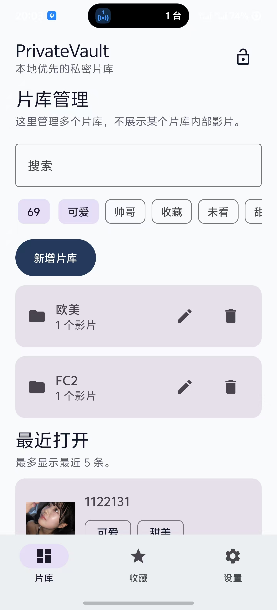
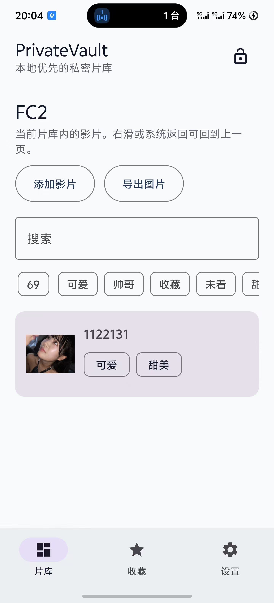

## Screenshots

<table>
  <tr>
    <td align="center" width="50%">
      
      <br />
      <sub>片库管理</sub>
    </td>
    <td align="center" width="50%">
      
      <br />
      <sub>收藏</sub>
    </td>
  </tr>
  <tr>
    <td align="center" width="50%">
      
      <br />
      <sub>片库详情</sub>
    </td>
    <td align="center" width="50%">
      
      <br />
      <sub>设置</sub>
    </td>
  </tr>
</table>


# PrivateVault_QY

**一个本地优先的 Android 私密媒体库。**

> PrivateVault_QY 是一个完全离线的 Android 私密媒体管理器。
> 它可以将你选中的图片迁移到 App 私有目录，并支持媒体库、标签、收藏、备注、搜索和导出。
> 无账号、无云端、无服务器，数据只保存在你的设备本地。

---

## 为什么做这个

手机系统相册更像一个“公共区域”。

借手机、投屏、分享截图、选择图片时，总有一些内容你不希望直接暴露在系统相册里。

PrivateVault_QY 提供一个本地私密空间：你可以将选中的图片复制到 App 内部私有目录，并在确认导入成功后选择从系统相册中移除原图。

这样，系统相册保持干净，私密内容仍然保存在你的手机本地。

---

## 功能特性

| 功能                  | 说明                                                         |
| --------------------- | ------------------------------------------------------------ |
| 📚 **媒体库管理**      | 按媒体库组织内容，每个媒体库独立管理                         |
| 🖼️ **图片导入 / 迁移** | 支持复制保留原图，也支持导入后请求删除系统相册原图           |
| ⭐ **收藏**            | 星标收藏重要内容，独立入口快速查看                           |
| 🏷️ **标签**            | 自定义标签，支持搜索和筛选                                   |
| 📝 **备注**            | 为媒体条目记录整理状态、来源信息或补充说明                   |
| 🔍 **搜索筛选**        | 支持名称搜索和标签组合筛选                                   |
| 🔗 **外部链接管理**    | 可记录网盘链接、下载链接或其他来源链接；仅保存文本，不下载内容 |
| 💾 **导出**            | 支持将图片导出回系统相册                                     |
| 🔐 **锁屏入口**        | 支持切后台后进入锁屏页；PIN 持久化和生物识别仍在路线图中     |
| 📱 **本地优先**        | 不需要账号、不上传文件、不依赖服务器                         |

---

## 快速开始

使用 Android Studio 打开项目，等待 Gradle Sync 完成后点击 Run。

```text
要求：
- Android Studio Hedgehog 或更新版本
- JDK 17+
- Android SDK API 36
```

命令行构建：

```bash
./gradlew :app:testDebugUnitTest
./gradlew assembleDebug
```

---

## 项目结构

```text
app/src/main/java/com/privatevault/
├── core/      纯 Kotlin 领域模型，零 Android 依赖
├── data/      Room 持久化：DAO / Store / Repository
├── media/     文件导入、导出、原图删除请求
├── ui/        Jetpack Compose 界面与 ViewModel
└── MainActivity.kt
```

---

## 技术栈

* Kotlin
* Jetpack Compose
* Material 3
* Room + KSP
* Coil
* Coroutines Flow
* JUnit 4

---

## 实现状态

已完成：

* 媒体库 CRUD
* 媒体条目增删
* 图片导入 / 迁移
* 系统确认删除原图
* Room 本地持久化
* 外部链接 CRUD
* 标签 CRUD
* 收藏
* 搜索筛选
* 全屏预览
* 图片导出
* 种子数据
* 返回栈导航

路线图：

* PIN 持久化
* 生物识别解锁
* 文件级加密
* 私密备份包导出
* 批量操作优化

---

## 隐私与安全说明

PrivateVault_QY 是一个本地优先的私密媒体管理工具。

当前版本中，导入文件会保存到 App 私有目录，其他普通 App 无法直接访问这些文件。但当前版本尚未实现文件级加密。

如果你需要更强的安全模型，请关注后续版本中的文件加密和生物识别功能。

重要提醒：

卸载 App 前，请先导出你需要保留的文件。App 卸载可能会清除 App 私有目录中的数据。

---

## License

MIT

---

## 贡献

欢迎提交 Issue 和 PR。

这是一个个人项目。如果你想贡献较大的功能，建议先开 Issue 讨论设计方向，避免重复开发。
