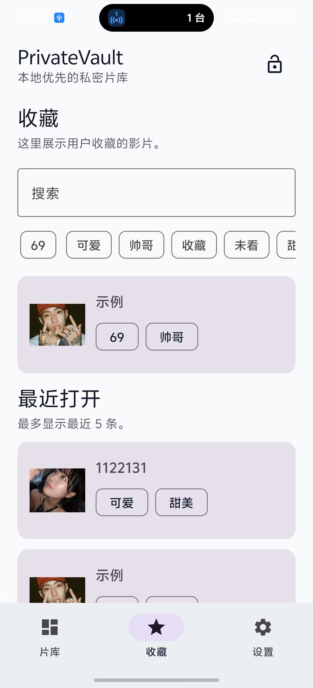
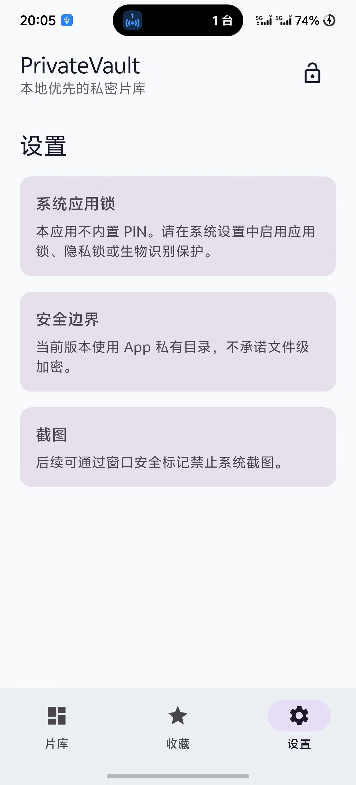

<p align="center">
  
  
  
  
</p>

# PrivateVault

**你的手机相册，由你决定谁能看。**

> 一个完全离线的 Android 私密媒体管理器——不注册、不联网、不存云端。
> 把不想出现在相册里的内容放到这里，像管理私人片库一样整理它。

---

## 为什么做这个

手机相册是一个"公共区域"——借手机、投屏、分享截图时，总有一些内容你不想被看到。

PrivateVault 给你一个**真正私密的第二相册**。图片复制到 App 内部私有目录后，你可以选择**从系统相册中彻底删除原图**——相册干净了，内容也还安全地留在你的手机里。

---

## 一眼看全

| | |
|---|---|
| 📚 **片库** | 以影片为单位组织内容，每个片库独立管理 |
| 🖼️ **图片导入** | 复制保留原图，或者**迁移**——复制后删除原图，从相册彻底消失 |
| ⭐ **收藏** | 星标一键收藏，独立 Tab 快速浏览 |
| 🏷️ **标签** | 自定义标签，支持搜索和筛选 |
| 🔗 **网盘链接** | 夸克 / 百度网盘 / 迅雷 / 磁力链接一把抓 |
| 📝 **备注** | 随手记录整理状态、来源信息 |
| 🔍 **搜索筛选** | 影片名搜索 + 标签组合筛选 |
| 💾 **导出** | 随时将图片导出回系统相册 |
| 🔐 **锁屏** | 切到后台自动锁定，任何密码即可进入 |
| 📱 **零权限** | 不需要联网、不需要账号、不需要任何敏感权限 |

---

## 快速开始

用 Android Studio 打开项目，Sync Gradle，点击 Run。

```
要求：Android Studio Hedgehog 或更新、JDK 17+、SDK API 36
```

命令行构建：

```bash
./gradlew :app:testDebugUnitTest   # 单测
./gradlew assembleDebug            # 打 APK
```

---

## 项目结构

```
app/src/main/java/com/privatevault/
├── core/      纯 Kotlin 领域模型，零 Android 依赖
├── data/      Room 持久化（DAO / Store / Repository）
├── media/     文件导入 / 导出 / 删除原图
├── ui/        Jetpack Compose 界面 + ViewModel
└── MainActivity.kt
```

## 技术栈

Jetpack Compose · Material 3 · Room + KSP · Coil · Coroutines Flow · JUnit 4

---

## 实现状态

**已完成：** 片库 CRUD · 影片增删 · 图片导入/迁移 · 系统确认删原图 · Room 全量落库 · 链接 CRUD · 标签 CRUD · 收藏 · 搜索筛选 · 全屏预览 · 图片导出 · 种子数据 · 返回栈导航

**路线图：** PIN 持久化 · 生物识别 · 文件加密

---

## 安全声明

当前版本文件存储在 App 私有目录中，其他 App 无法访问，但**未做文件级加密**。如果你需要强加密方案，欢迎参与或关注后续版本。

---

## License

MIT

---

## 贡献

欢迎 Issue 和 PR。这是个人项目，建议先开 Issue 讨论方向，避免重复劳动。
